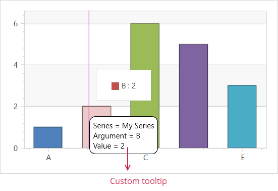

<!-- default badges list -->

<!-- default badges end -->

# Chart for WPF - Display custom tooltips over the data point currently hovered by the mouse pointer

This example displays custom information for every data point from the underlying datasource in a tooltip.

If you wish to learn how to use built-in tooltips in your application, see the [Tooltips](https://docs.devexpress.com/WPF/11975/controls-and-libraries/charts-suite/chart-control/tooltip-and-crosshair-cursor/tooltip) topic.

<!-- default file list -->
## Files to Review

* [Window1.xaml](./CS/Window1.xaml) (VB: [Window1.xaml](./VB/Window1.xaml))
* [Window1.xaml.cs](./CS/Window1.xaml.cs) (VB: [Window1.xaml.vb](./VB/Window1.xaml.vb))
<!-- default file list end -->
<!-- feedback -->
## Does This Example Address Your Development Requirements/Objectives?

 

(you will be redirected to DevExpress.com to submit your response)
<!-- feedback end -->
